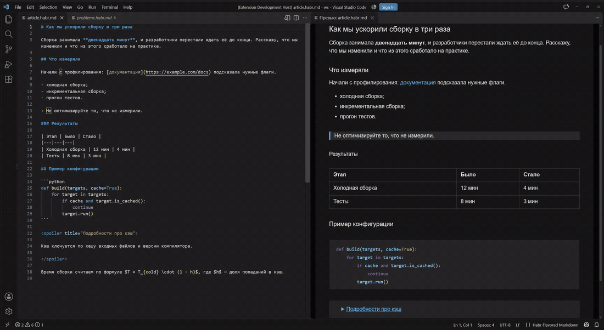
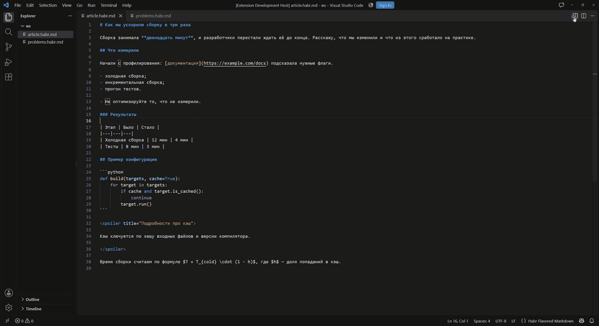
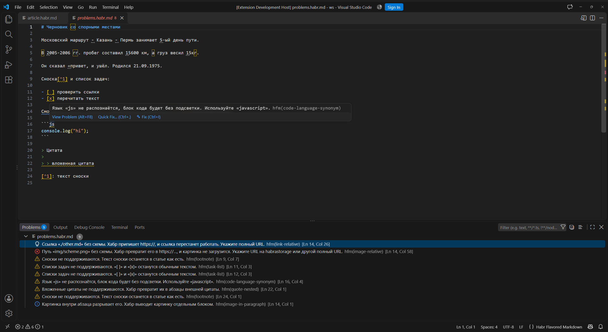

# Markdown Preview for Habr

Превью статьи в том виде, в каком её отрисует Хабр, и диагностика конструкций, которые Хабр не поддерживает.
Работает с файлами `*.habr.md` (язык HFM, Habr Flavored Markdown). Любой другой `.md` тоже подойдёт: достаточно выбрать язык «Habr Flavored Markdown».

> Расширение не связано с Хабром и не одобрено им. Рендер построен по наблюдениям за предпросмотром Хабра,
> возможны расхождения: [сообщить об ошибке](https://github.com/KrimsN/hfm-preview/issues).



## Установка

| Источник | Для чего | Как |
|---|---|---|
| [VS Code Marketplace](https://marketplace.visualstudio.com/items?itemName=krimsn.hfm-preview) | VS Code | Extensions → «Markdown Preview for Habr» → Install |
| [Open VSX](https://open-vsx.org/extension/krimsn/hfm-preview) | VSCodium, Cursor, Windsurf и др. | Extensions → «Markdown Preview for Habr» → Install |
| [Releases](https://github.com/KrimsN/hfm-preview/releases) | офлайн, конкретная версия | Extensions → `…` → Install from VSIX… |

Из командной строки и из исходников (Node.js 24):

```bash
code --install-extension hfm-preview-0.1.3.vsix

git clone https://github.com/KrimsN/hfm-preview.git && cd hfm-preview
npm ci && npm run package && code --install-extension hfm-preview-*.vsix
```

## Использование

1. Откройте файл `*.habr.md`. Для другого `.md`: язык в строке состояния (справа внизу) → «Habr Flavored Markdown».
2. Нажмите кнопку превью в заголовке редактора или команду «Открыть превью сбоку (Habr)».
3. Тема превью переключается в контекстном меню.

Чтобы язык выбирался сам, добавьте ассоциацию в `settings.json` (для всех `.md` или только для нужной папки):

```json
"files.associations": { "*.md": "hfm" }
```

## Настройки

| Настройка | По умолчанию | Описание |
|---|---|---|
| `hfm.diagnostics.enabled` | `true` | Предупреждения о конструкциях, которые Хабр не поддерживает или ломает |
| `hfm.diagnostics.typography` | `true` | Подсказки по типографике Хабра |
| `hfm.diagnostics.rules` | `{}` | Уровень отдельных правил по коду: `off`, `error`, `warning`, `information`, `hint`. Например, `{ "image-external": "off" }` |
| `hfm.toc.transliterate` | `true` | Имена якорей латиницей (`kak-eto-rabotaet`), чтобы ссылка не превращалась в `%D0%BA…` при копировании |
| `hfm.preview.theme` | `auto` | Тема превью: `auto` (как в VS Code), `light`, `dark` |
| `hfm.preview.scrollSync` | `true` | Синхронизация прокрутки превью и редактора |

## Возможности

### Превью

- Заголовки, списки, цитаты, таблицы, ссылки и картинки с подписями — с теми же преобразованиями, что на Хабре.
- Спойлеры, формулы, `<persona>`, вставки видео и соцсетей (заглушки).
- Подсветка кода для языков из списка Хабра.
- Локальные картинки показываются до загрузки на habrastorage.
- Светлая и тёмная тема, синхронизация прокрутки, восстановление после перезапуска VS Code.



### Редактирование

- **Списки.** Enter в пункте создаёт следующий (у нумерованного — со следующим номером, остальные пункты перенумеровываются);
  Enter в пустом пункте убирает маркер или поднимает вложенный пункт на уровень выше. Tab вкладывает пункт в предыдущий
  вместе с его вложенными пунктами, Shift+Tab поднимает. Вне списков клавиши работают как обычно.
- **Автодополнение.** После `](#` — якоря документа с подписью заголовка; после `` ``` `` — языки подсветки Хабра; после выбора языка блок закрывается ограждением на новой строке, если закрытия ещё нет;
  после `<` в начале строки — заготовки `<anchor>`, `<spoiler>`, `<persona>`, `<oembed>`, а внутри строки — `<abbr>`.

### Оглавление

Команда «HFM: Собрать оглавление с якорями» (палитра команд) ставит `<anchor>` перед каждым заголовком
и вставляет список ссылок на них в позицию курсора (заголовки глубже третьего уровня идут как третий, как на Хабре). Хабр не создаёт `id` у заголовков сам, поэтому
без якорей ссылки `#раздел` не работают. Список окружён комментариями `<!-- toc -->` и `<!-- /toc -->`,
Хабр их отбрасывает; повторный запуск обновляет список и не дублирует якоря.

### Frontmatter статьи

Команда «HFM: Вставить frontmatter статьи» добавляет в начало файла YAML-блок с полями публикации Хабра.
Блок и все его поля необязательны: пустые поля не считаются ошибкой. В превью блок не попадает.

```yaml
---
Заголовок: Как мы переписали ленту
Хабы: [Python, Разработка]
Ключевые слова: [ленты, хабр]
Целевая аудитория:
Формат: Кейс
Сложность: Средний
Язык: ru
Перевод: false
КДПВ: img/cover.png
Текст в ленте: |
  Текст под КДПВ в ленте — по нему читатель решает, открывать ли статью. Расскажите, о чём она и чем будет полезна.
---
```

Поля подсказываются при вводе (ключи, форматы, сложность, язык). Проверяются только заполненные значения:
не больше 5 хабов и 10 ключевых слов, формат и сложность из справочника Хабра, существование и расширение файла КДПВ,
длина текста в ленте (от 100 до 3000 символов, рекомендуется до 2000), отсутствие в нём разметки кроме ссылок.
Путь в поле «КДПВ» открывается по Ctrl+клику или командой «HFM: Открыть КДПВ».

Название статьи задаётся полем «Заголовок», а не `#` в тексте: в HFM `#` — заголовок второго уровня.
Если в тексте единственный `#`, а остальные заголовки глубже, расширение подскажет об этом.

### Диагностика

| Группа | Что проверяется |
|---|---|
| Ломается на Хабре | ссылки и картинки без схемы, `#якоря` без `<anchor>`, внешние `` |
| Frontmatter | неизвестные поля, значения вне справочников, лимиты хабов и ключевых слов, файл КДПВ, длина и разметка текста в ленте |
| Теряется при публикации | сноски, списки задач, вложенные цитаты, код и заголовки в цитатах, выравнивание таблиц, ссылки вокруг картинок, неподдерживаемые HTML-теги и атрибуты, эмодзи-шорткоды, зачёркивание одной тильдой |
| Код | неизвестные языки и синонимы (`js` → `javascript`) |
| Типографика (подсказки) | кавычки, тире и интервалы, пробелы в числах и перед единицами, окончания порядковых, даты, инициалы — по [правилам Хабра](https://habr.com/ru/docs/authors/typographics/) |

Для большинства правил есть быстрое исправление (Ctrl+.).



## Ограничения

- Превью приближает отрисовку Хабра, но не заменяет его предпросмотр: перед публикацией сверяйтесь с Хабром.
- Картинки на habrastorage расширение не загружает, только предупреждает о внешних источниках.
- Для файлов с языком HFM встроенные функции VS Code для Markdown (превью, вставка ссылок и др.) не работают. Outline заголовков расширение строит само.
- Расширение работает только в десктопной версии VS Code (vscode.dev и github.dev не поддерживаются). В виртуальных рабочих папках не проверяется существование файла КДПВ и не показываются локальные картинки.
- В ограниченном режиме (Restricted Mode) расширение работает: оно не выполняет код из открытой папки.

## Разработка

```bash
npm ci
npm test             # тесты, включая снапшоты по эталонам Хабра
npm run typecheck
npm run build
```

Запуск в окне разработки: F5 (конфигурация «живое обновление») или `npm run host`.
Правила диалекта лежат в `src/data/`: языки подсветки, вставки, тексты диагностик.

## Лицензия

[MIT](LICENSE)
