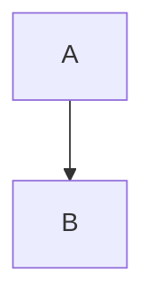

## T16 Код

T16a Без языка:

```
plain code block
```

T16b Языки из списка Хабра:

```python
def hello(name: str) -> str:
    return f"Привет, {name}"
```

```xml
<div class="test">HTML через xml</div>
```

```cpp
int main() { return 0; }
```

```cs
var x = new List<int>();
```

```1c
Сообщить("Привет");
```

```pgSQL
SELECT now();
```

T16c Синонимы и языки вне списка:

```js
const a = 1;
```

```html
<p>html вместо xml</p>
```

```sh
echo sh
```

```c
int c = 0;
```

```c++
auto cpp = 1;
```

```csharp
var csharp = 1;
```

```yml
key: value
```

```dockerfile
FROM alpine:3.20
```

```toml
key = "value"
```



```несуществующий
unknown language
```

T16d Длинная строка:

```javascript
const veryLongLine = "Эта строка специально очень длинная, чтобы проверить, появится ли горизонтальная прокрутка или строка перенесётся внутри блока кода на Хабре и как это выглядит на узкой колонке";
```

T16e Пустые строки и отступы табами внутри кода:

```go
func main() {
	fmt.Println("tab indent")


	fmt.Println("after two empty lines")
}
```

T16f Ограничитель из тильд:

~~~python
print("tilde fence")
~~~

T16g Отступной блок кода (4 пробела):

    indented code block
    second line

T16h Четыре обратные кавычки с тройными внутри:

````markdown
```python
print("nested fence")
```
````
